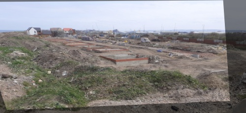

# Image Alignment

This project uses OpenCV to align similar images taken from different perspectives.
The implementation is based on [this tutorial](https://pyimagesearch.com/2020/08/31/image-alignment-and-registration-with-opencv/).

Take these two images as inputs

  
   

Use an ORB algorithm to identify keypoints, which can be matched between the images.

Compute the homography matrix between the two sets of matched points and tranform the second image to align it with the first

By overlaying it onto the original image, we can judge the effectiveness of the operation

